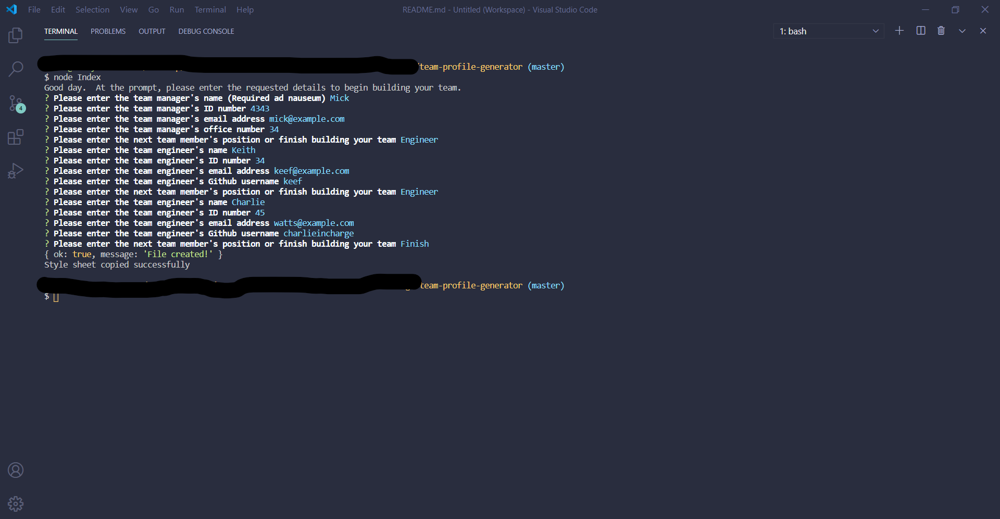

# Team Profile Generator

## Description
A Node.js command-line application that takes in information about employees on a software engineering team and generates an HTML webpage that displays summaries for each person.

##### Command Line View

##### Finished Product View

## Table of Contents
  * [Installation](#installation)
  * [Usage](#usage)
  * [License](#license)
  * [Technologies](#technologies)
  * [Contributing](#contributing)
  * [Testing](#testing)
  * [Questions](#questions)
  
## Installation
Clone project to a directory on your local machine and cd into the team-profile-generator directory.  Run npm install to install inquirer package

## Usage
Run node Index to launch application and answer all of the questions that are prompted in the terminal.  When all questions have been answered, your index.html file will appear in the dist folder along with a custom stylesheet, where you can copy it to your project's directory where needed.
[view demo](https://drive.google.com/file/d/13Fr2NtNjTjwbumeZLdQ5HMzYugiWGzvE/view)

## License 
This project is covered under the MIT license 

## Technologies 
Node.js, Inquirer, Jest

## Contributing
To see the guidelines adopted for contributing to this project, please view the [Contributor Covenant](https://www.contributor-covenant.org/version/2/0/code_of_conduct/code_of_conduct.txt)

## Testing
run npm test Employee to run jest testing framework on the Employee class, or npm test to test all modules having tests.

## Questions
Visit me at GitHub  
[christopherConcannon](https://github.com/christopherConcannon)
  
If you have any questions or would like to contact me, please email me at  
[cmcon@yahoo.com](mailto:cmcon@yahoo.com)
